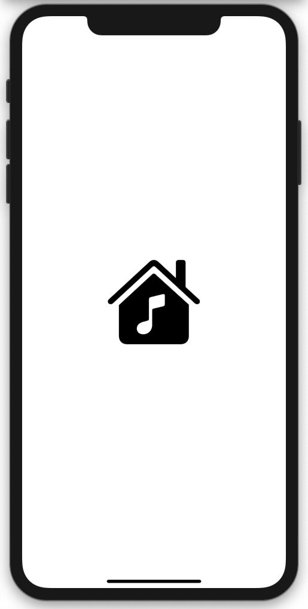
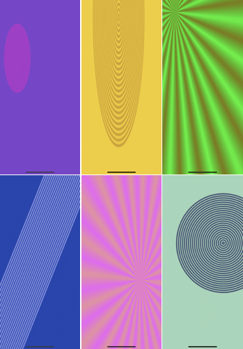

# MusicWithColor
App that plays music and displays colors. 

Wallpaper by Kevin MacLeod \
Link: https://incompetech.filmmusic.io/song/4604-wallpaper \
License: http://creativecommons.org/licenses/by/4.0/ \

**Features:** 
- View is of list of system colors.
- Web link to Human Interface Guidelines.

*Examples of Color Displays* \

**Technical Info:** \
Xcode 11 project written in Swift 5 for iOS\

**Installation:**
1. Open project in Xcode
2. Go to project settings for the target and update the your signing information(signing and capabilities)
3. Build and run the app in Xcode. 

**Author:** \
Marcy Vernon [@MarcyVernon](https://twitter.com/MarcyVernon)

**License:** \
"Music With Color" is under the MIT license. See [LICENSE](/LICENSE) for more information.
